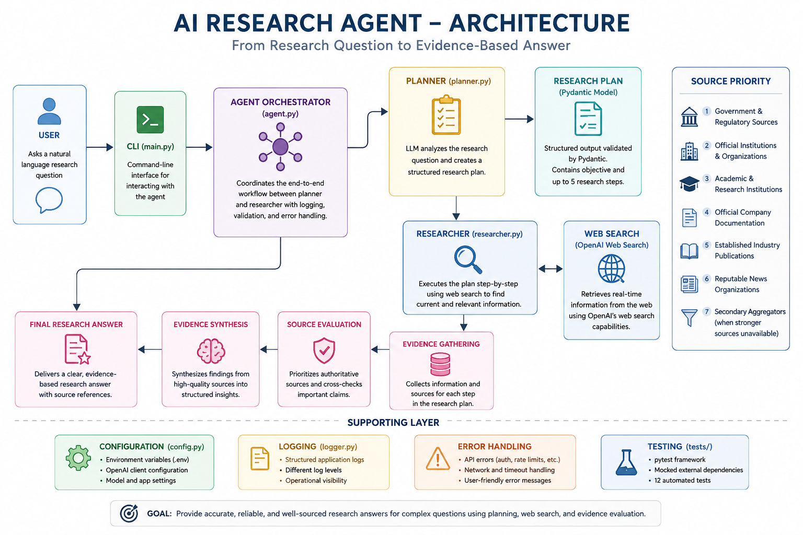

# 🔎 AI Research Agent

A research-focused AI agent built from first principles using Python and the OpenAI API.

The agent converts a research question into a structured research plan, searches the web for current information, prioritizes reliable sources, cross-checks important claims, and synthesizes the evidence into a research answer.

This project was built incrementally to understand how AI agents work internally — from basic rule-based logic to planning, tool use, structured outputs, modular architecture, error handling, and automated testing.

---

## ✨ What It Does

The AI Research Agent can:

- Accept natural-language research questions
- Generate a structured research plan
- Perform real-time web research
- Prioritize authoritative and primary sources
- Cross-check important factual claims
- Distinguish evidence from analysis
- Produce research answers based on gathered evidence
- Handle API and application errors gracefully
- Validate planner output using structured schemas
- Run automated tests without making real API calls

### Example Research Request

```text
Research the most promising AI automation opportunities
for small businesses in India.
```

The workflow becomes:

```text
Research Question
       ↓
Research Planner
       ↓
Structured ResearchPlan
       ↓
Research Executor
       ↓
Web Search
       ↓
Evidence Gathering
       ↓
Source Evaluation
       ↓
Final Research Answer
```

---

# 🏗️ Architecture

The final version uses a modular planner-researcher architecture.

```text
                         USER
                          │
                          ▼
                     ┌─────────┐
                     │ main.py │
                     └────┬────┘
                          │
                          ▼
                  ┌───────────────┐
                  │   AI Agent    │
                  │ Orchestrator  │
                  └───────┬───────┘
                          │
                          ▼
                  ┌───────────────┐
                  │    Planner    │
                  │      LLM      │
                  └───────┬───────┘
                          │
                          ▼
                   ResearchPlan
                  (Pydantic Model)
                          │
                          ▼
                  ┌───────────────┐
                  │  Researcher   │
                  │      LLM      │
                  │       +       │
                  │  Web Search   │
                  └───────┬───────┘
                          │
                          ▼
                   Evidence-Based
                   Research Answer
```

Supporting engineering components:

```text
Configuration
     │
     ├── Environment variables
     └── OpenAI client

Reliability
     │
     ├── Input validation
     ├── Structured output validation
     ├── Error handling
     └── Application logging

Testing
     │
     ├── pytest
     ├── Mocked dependencies
     └── 12 automated tests
```

---

# 🧠 How the Agent Works

## 1. Research Planning

The planner receives the user's research question and determines what needs to be investigated.

Instead of returning unrestricted text, the planner produces a structured `ResearchPlan`.

Example:

```python
ResearchPlan(
    objective="Identify promising AI automation opportunities.",
    steps=[
        "Assess current adoption trends.",
        "Identify high-value automation workflows.",
        "Compare the strongest opportunities."
    ]
)
```

The schema is validated using Pydantic.

---

## 2. Research Execution

The structured plan is passed to the researcher.

The researcher executes the plan using web search to gather current external information.

It prioritizes sources roughly in this order:

1. Government and regulatory sources
2. Official institutions and organizations
3. Academic and research institutions
4. Official company documentation
5. Established industry publications
6. Reputable news organizations
7. Secondary aggregators when stronger sources are unavailable

---

## 3. Evidence Evaluation

The researcher follows evidence guardrails designed to reduce unsupported claims.

Important factual claims should be supported by reliable evidence.

The agent is instructed to:

- Prefer primary sources
- Cross-check important claims when practical
- Identify disagreement between credible sources
- Separate sourced facts from analysis
- Avoid inventing statistics, market sizes, prices, ROI figures, dates, or company claims
- Explicitly acknowledge information that cannot be verified

---

## 4. Research Synthesis

Once sufficient evidence has been collected, the agent synthesizes the findings.

Response depth depends on the research request.

A focused factual request receives a concise research answer.

A broader market or opportunity analysis can produce a more detailed structured report.

---

# 🗂️ Project Structure

```text
01-research-agent/
│
├── src/
│   ├── __init__.py
│   ├── agent.py
│   ├── config.py
│   ├── logger.py
│   ├── models.py
│   ├── planner.py
│   ├── prompts.py
│   └── researcher.py
│
├── tests/
│   ├── __init__.py
│   ├── test_agent.py
│   ├── test_models.py
│   ├── test_planner.py
│   └── test_researcher.py
│
├── learning_versions/
│   ├── v1_rule_based.py
│   ├── v2_first_llm_call.py
│   ├── v2_llm_decision.py
│   ├── v3_manual_tool.py
│   ├── v4_tool_calling.py
│   ├── v5_agent_loop.py
│   ├── v6_web_search.py
│   ├── v6.1_multi_tool.py
│   ├── v7_agent_loop.py
│   └── v8_planning_agent.py
│
│
├── main.py
├── README.md
├── requirements.txt
├── pytest.ini
├── .env.example
└── .gitignore
```

### Core Components

| Component | Responsibility |
|---|---|
| `main.py` | CLI entry point |
| `agent.py` | Orchestrates the complete workflow |
| `planner.py` | Creates the structured research plan |
| `researcher.py` | Executes research using web search |
| `models.py` | Defines structured Pydantic models |
| `prompts.py` | Stores planner and researcher instructions |
| `config.py` | Handles configuration and OpenAI client creation |
| `logger.py` | Provides application logging |
| `tests/` | Automated unit tests |
| `learning_versions/` | Earlier versions showing the project's evolution |

---

# 🛠️ Tech Stack

- **Python**
- **OpenAI Responses API**
- **OpenAI Web Search**
- **Pydantic**
- **pytest**
- **unittest.mock**
- **python-dotenv**
- **Python logging**

---

# 🚀 Getting Started

## 1. Clone the Repository

```bash
git clone https://github.com/saqbyte/ai-research-agent.git
cd ai-agent-journey/01-research-agent
```

## 2. Create a Virtual Environment

### Windows

```powershell
python -m venv .venv
.venv\Scripts\activate
```

### macOS / Linux

```bash
python -m venv .venv
source .venv/bin/activate
```

## 3. Install Dependencies

```bash
pip install -r requirements.txt
```

## 4. Configure Environment Variables

Copy:

```text
.env.example
```

to:

```text
.env
```

Then add your API key:

```env
OPENAI_API_KEY=your_api_key_here
OPENAI_MODEL=gpt-5-mini
LOG_LEVEL=INFO
```

> Never commit your `.env` file or API key to GitHub.

## 5. Run the Agent

```bash
python main.py
```

Example:

```text
AI Research Agent
=================

What would you like me to research?
```

Enter a research-focused question such as:

```text
What are the most promising AI automation opportunities
for small businesses in India?
```

---

# 🧪 Automated Testing

The project uses `pytest` and mocks external dependencies so the core application can be tested without making real OpenAI API calls.

Run:

```bash
python -m pytest -v
```

Current test suite:

```text
12 passed
```

Tests cover:

- Input validation
- ResearchPlan creation
- Pydantic schema validation
- Maximum planner steps
- Agent orchestration
- Structured planner output
- Empty planner responses
- Research execution
- Empty research responses
- Web-search configuration

This allows the application logic to be tested quickly without consuming API credits.

---

# 🛡️ Error Handling & Logging

The application handles common failures including:

- Invalid API credentials
- Rate limits
- API timeouts
- Connection failures
- Bad requests
- Empty planner output
- Empty research output
- Invalid user input

Example:

```text
INFO | src.agent | Research workflow started.
INFO | src.planner | Creating research plan.
ERROR | src.planner | OpenAI authentication failed during planning.

Research failed:
Authentication with OpenAI failed. Check your API key.
```

This keeps application-facing errors understandable while retaining useful operational logging.

---

# 📈 Development Journey

This project was deliberately built incrementally rather than starting with an agent framework.

| Version | Milestone | Key Learning |
|---|---|---|
| V1 | Rule-Based Research | Deterministic routing and basic program flow |
| V2 | LLM Integration | Moving decisions from rules to an LLM |
| V3 | Manual Custom Tool | Understanding tools as Python functions |
| V4 | Function Calling | Allowing the model to request tools |
| V5 | Tool Result Handling | Returning tool results to the model |
| V6 | Web Search | Accessing current external information |
| V7 | Agent Loop | Repeated model → tool → model execution |
| V8 | Planning Agent | Separating planning from execution |
| V9.1 | Modular Architecture | Separation of concerns |
| V9.2 | Structured Outputs | Pydantic schemas and component contracts |
| V9.3 | Logging & Error Handling | Production-style reliability |
| V9.4 | Automated Testing | pytest and dependency mocking |
| V9.5 | Evidence Guardrails | Source quality and research reliability |

The progression can be summarized as:

```text
Rules
  ↓
LLM
  ↓
Tools
  ↓
Tool Calling
  ↓
Agent Loop
  ↓
Web Research
  ↓
Planning
  ↓
Structured Outputs
  ↓
Modular Architecture
  ↓
Reliability
  ↓
Automated Testing
  ↓
Research Quality
```

---

# 💡 What I Learned

Building the project incrementally helped me understand that an AI agent is more than an LLM prompt.

A useful agent requires coordination between:

```text
Reasoning
   +
Planning
   +
Tools
   +
External Information
   +
State / Control Flow
   +
Validation
   +
Software Architecture
   +
Testing
```

Some of the most important concepts I learned include:

- LLM API integration
- Tool/function calling
- Agent execution loops
- Real-time web research
- Planner/executor architecture
- Prompt design
- Structured LLM outputs
- Pydantic validation
- Separation of concerns
- Application logging
- Exception handling
- Dependency mocking
- Unit testing
- Source-quality guardrails

---

# ⚠️ Limitations

This project is intentionally optimized for **research-oriented tasks**, not low-latency general conversation.

As a result:

- Research requests can take longer than standard LLM responses because the agent performs planning and web research.
- Research workflows may consume more tokens than simple chatbot responses.
- Web information can still contain inaccuracies or conflicting claims.
- Source quality depends partly on what information is publicly available.
- Research conclusions should not automatically be treated as professional financial, legal, medical, or other high-stakes advice.
- The current interface is command-line based.
- The project focuses on understanding agent architecture rather than providing a production SaaS interface.

---

# 🔮 Possible Future Improvements

The current version completes the learning objective for this project.

Potential future extensions could include:

- Persistent research sessions
- Research history
- Parallel research workers
- Citation/source extraction into structured data
- Export to Markdown or PDF
- REST API using FastAPI
- Web interface
- Database-backed research storage
- Evaluation datasets for research quality
- Cost and token usage tracking

These are intentionally left outside the current scope so the project remains focused.

---

# 🎯 Project Purpose

This is the first project in my AI agent development portfolio.

The primary goal was not simply to create a research chatbot.

The goal was to understand how an AI agent evolves from basic Python logic into a modular system capable of:

**planning → tool use → research → evidence evaluation → synthesis → validation**

while maintaining understandable software architecture and automated tests.

---

# 📄 License

This project is intended for educational and portfolio purposes.

---

## Project Status

**Project #01 — AI Research Agent: Complete ✅**

**Automated Tests:** 12 passing  
**Interface:** CLI  
**Architecture:** Planner → Researcher  
**Research Capability:** Real-time web search  
**Structured Output:** Pydantic  
**Testing:** pytest + mocked external dependencies

## 🏗️ Architecture


